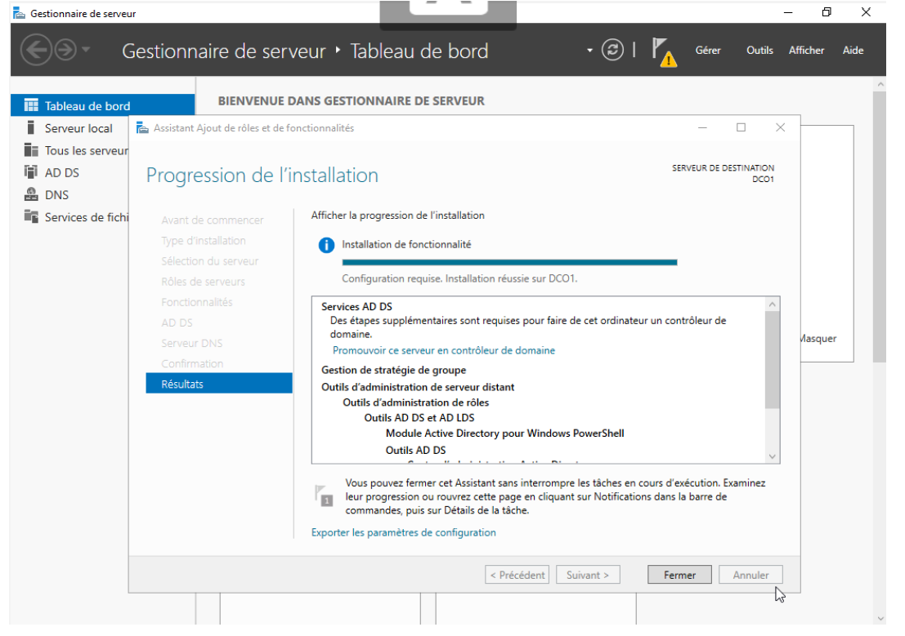
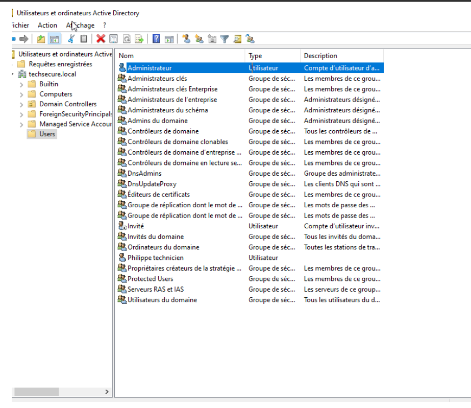
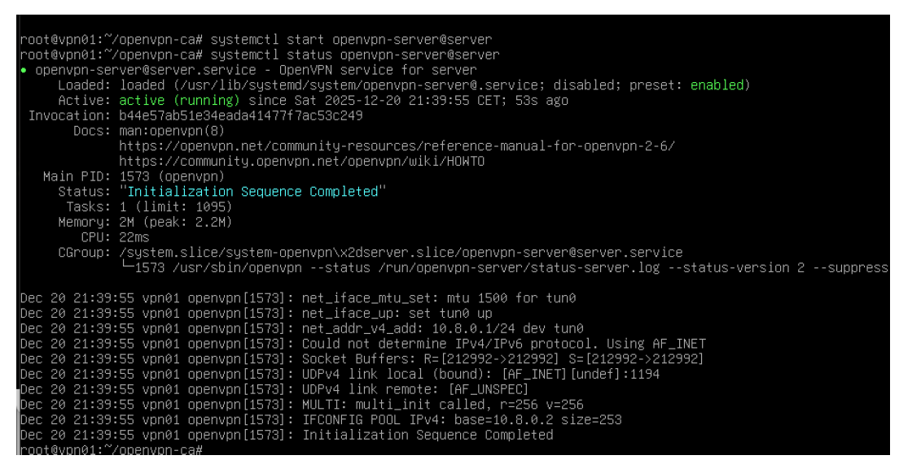
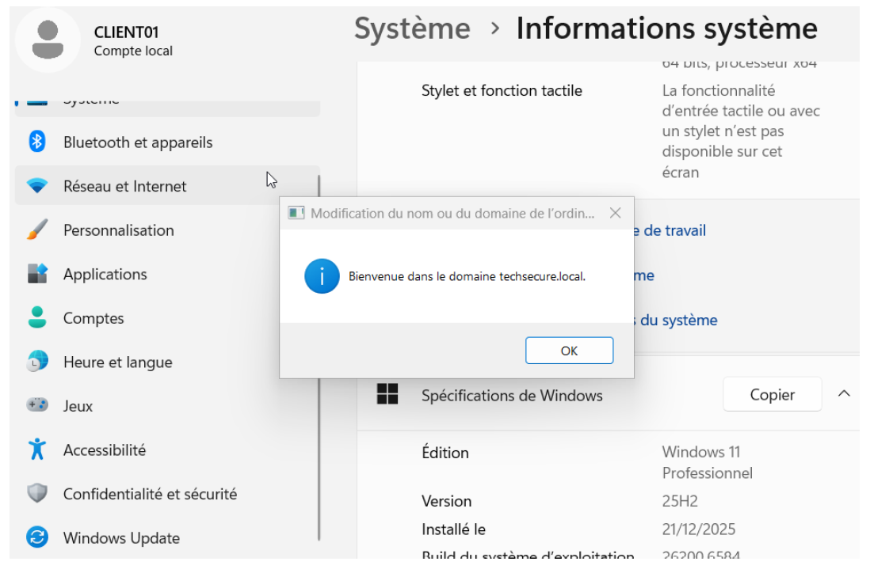
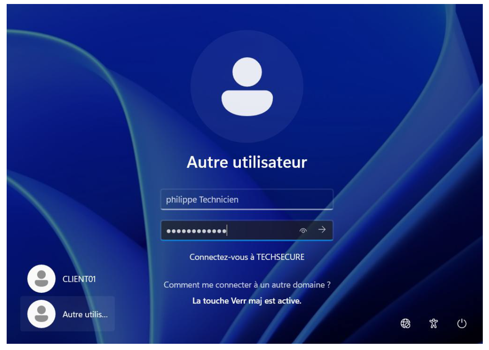

# 🔐 TechSecure : Architecture Active Directory & VPN à Certificats
> Projet Infrastructure & Sécurité | ECE Paris

---
### 📄 [Consulter le Rapport Technique Complet (PDF)](../RAPPORT TP MINI PROJET.pdf)
---

## 📝 Objectif du Projet
Concevoir une infrastructure d'entreprise sécurisée centralisant la gestion des identités et permettant un accès distant robuste via une PKI.

## 🏗️ Phase 1 : Déploiement de l'Annuaire AD DS
L'installation a été réalisée sur Windows Server 2019, incluant les rôles DNS et les outils d'administration RSAT.

*Succès de l'installation du rôle Active Directory Domain Services.*

### Gestion des Identités & GPO
J'ai structuré l'annuaire avec des Unités d'Organisation (OU) pour segmenter les accès par département (RH, Tech, Direction).

*Vue de la console "Utilisateurs et ordinateurs Active Directory" avec les comptes configurés.*

## 🔒 Phase 2 : Sécurisation des Accès (VPN PKI)
Mise en place d'un serveur OpenVPN sur Linux avec une Autorité de Certification (CA) gérée via Easy-RSA.

*Vérification du service OpenVPN actif et de l'initialisation de la séquence sécurisée.*

## ✅ Phase 3 : Validation Utilisateur & Intégration
La réussite du projet est validée par l'intégration d'un poste client Windows 11 au domaine et la connexion d'un utilisateur distant.

*Confirmation de la jonction réussie au domaine techsecure.local.*

*Session ouverte avec succès pour l'utilisateur 'philippe Technicien' via l'authentification centralisée.*

---
[⬅️ Retour à l'accueil](../README.md)
