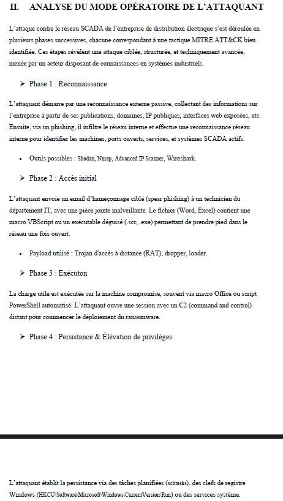
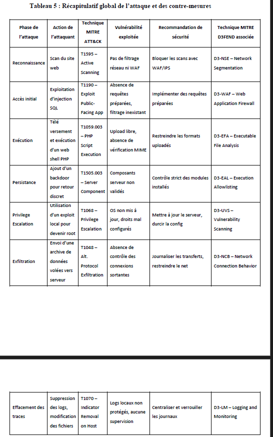
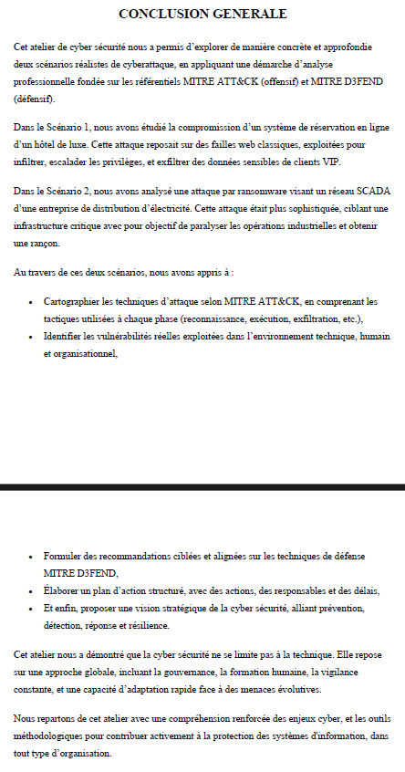

# 🛡️ Analyse Offensive & Stratégies de Défense (MITRE ATT&CK & D3FEND)
> Étude de Cas Cybersécurité Multi-Secteurs | Keyce Academy

---
### 📄 [Consulter le Rapport d'Analyse Complet (PDF)](../Rapport-MITRE-Franck-DEFFO.pdf)
---

## 📝 Objectif de l'Étude
Ce projet visait à modéliser le mode opératoire d'attaquants à travers deux scénarios réalistes. L'objectif était de décomposer chaque phase de l'attaque (Offensif) pour en déduire les contre-mesures les plus efficaces (Défensif).

---

## ⚡ Scénario : Ransomware sur Réseau Industriel (SCADA)
L'attaque simulée visait une infrastructure de distribution d'énergie, démontrant la criticité de la protection des systèmes industriels (OT).

*Modélisation des phases d'attaque : du Phishing initial au déploiement final du ransomware sur les systèmes de contrôle.*

### Analyse du Mode Opératoire
1.  **Infiltration** : Campagne de **Spear Phishing** ciblant un technicien avec une pièce jointe malveillante.
2.  **Mouvement Latéral** : Exploitation de failles de partage réseau pour atteindre les serveurs critiques SCADA.
3.  **Impact** : Chiffrement des systèmes de gestion et paralysie du réseau.

---

## 🛡️ Stratégies de Remédiation & Corrélation
L'utilisation des référentiels MITRE permet de transformer chaque technique offensive en une réponse défensive actionnable.

*Mapping technique : Corrélation entre les techniques d'attaque identifiées et les contre-mesures préconisées par le framework D3FEND.*

### Préconisations de Résilience
*   **Segmentation IT/OT** : Isolation du réseau industriel.
*   **Credential Hardening** : Mise en œuvre du MFA et rotation des identifiants.
*   **Sauvegardes Hors-Ligne** : Stratégie de backup immuable pour garantir la reprise d'activité sans paiement de rançon.

---

## ✅ Conclusion du Projet
L'approche par les frameworks mondiaux garantit une vision structurée de la menace et permet de prioriser les investissements de sécurité.

*Synthèse de l'étude démontrant l'efficacité d'un plan d'action fondé sur la résilience et la détection proactive.*

---
[⬅️ Retour à l'accueil](../README.md)
