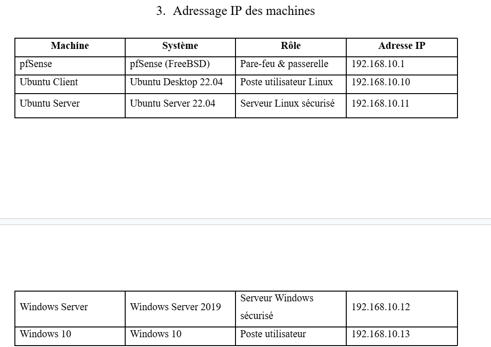
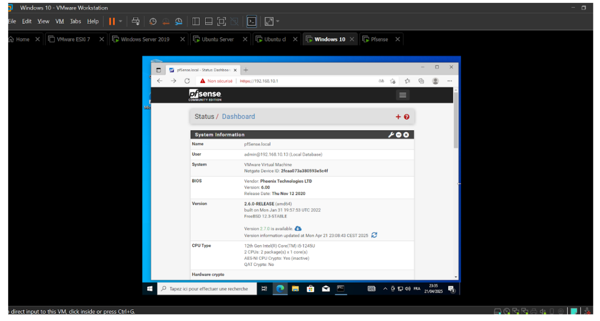
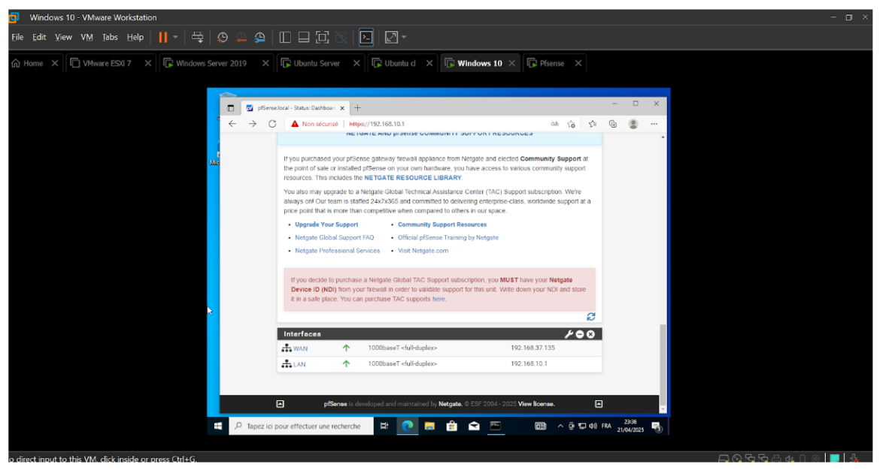
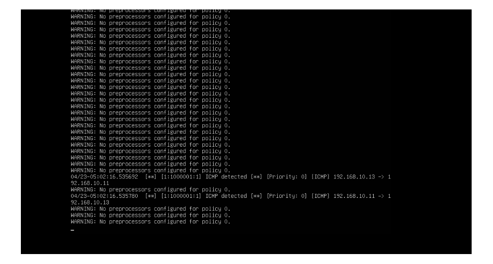
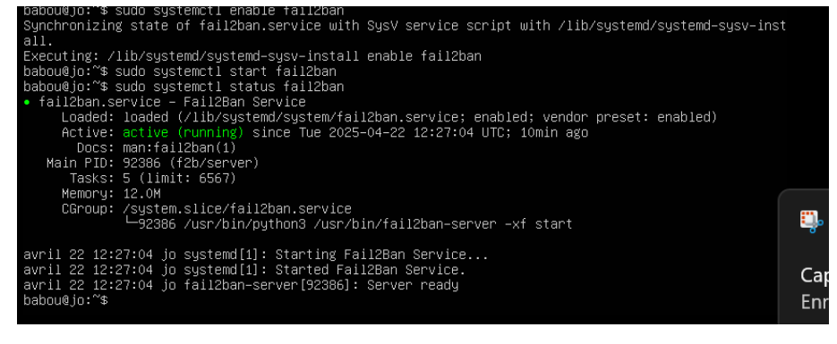

# 🛡️ POC "Cyber Limited" : Conception & Durcissement d'une Infrastructure Sécurisée
> Projet de Sécurisation Multi-Systèmes | Keyce Academy | Avril 2025

---
### 📄 [Consulter le Rapport Technique Complet (PDF)](../Rapport-Atelier-2-Franck-DEFFO.pdf)
---

## 📝 Contexte du Projet
L'objectif était de concevoir, déployer et sécuriser l'infrastructure complète d'une entreprise fictive nommée **Cyber Limited**. Ce Proof of Concept (POC) simule un environnement de production où chaque machine est protégée contre les intrusions via une défense en profondeur.

## 🏗️ Architecture du Lab (Virtualisation VMware)

*Architecture réseau isolée composée de 5 VM (Firewall, Serveurs, Clients) simulant un LAN d'entreprise sécurisé.*

## 🛠️ Réalisations Techniques

### 1. Sécurité Réseau avec pfSense
J'ai configuré pfSense comme passerelle centrale pour filtrer l'intégralité des flux entrants et sortants du réseau.

*Vue du centre de contrôle pfSense validant l'état des interfaces WAN/LAN et des services actifs.*

*Mise en œuvre de règles de filtrage strictes pour le contrôle du trafic inter-VLAN et la gestion du protocole ICMP.*

### 2. Détection d'Intrusions avec Snort (IDS)
Déploiement de **Snort** sur Ubuntu Server pour l'analyse des paquets en temps réel et la détection de comportements suspects.

*Preuve de détection : Capture d'une alerte ICMP générée en temps réel lors d'un test de pénétration simulé.*

### 3. Durcissement des Systèmes (Hardening)
Application de mesures proactives pour réduire la surface d'attaque des serveurs et postes clients.

*Mise en place de Fail2ban sur Linux pour automatiser le bannissement des IP tentant des attaques par force brute SSH.*

## 🛡️ Tests de Sécurité & Pentest
Pour valider l'efficacité des protections, des tests d'intrusion ont été menés :
*   **Scans de ports (Nmap)** : Confirmation de la fermeture des ports non essentiels.
*   **Brute Force SSH** : Validation du blocage automatique par Fail2ban.
*   **Ping Floods** : Test de résistance aux dénis de service (DoS).

## ✅ Résultats
*   Infrastructure 100% isolée et résiliente face aux menaces réseau courantes.
*   Visibilité complète sur les tentatives d'intrusion via l'IDS.
*   Maîtrise du cycle complet : Installation ➔ Configuration ➔ Durcissement ➔ Validation.

---
[⬅️ Retour à l'accueil](../README.md)
