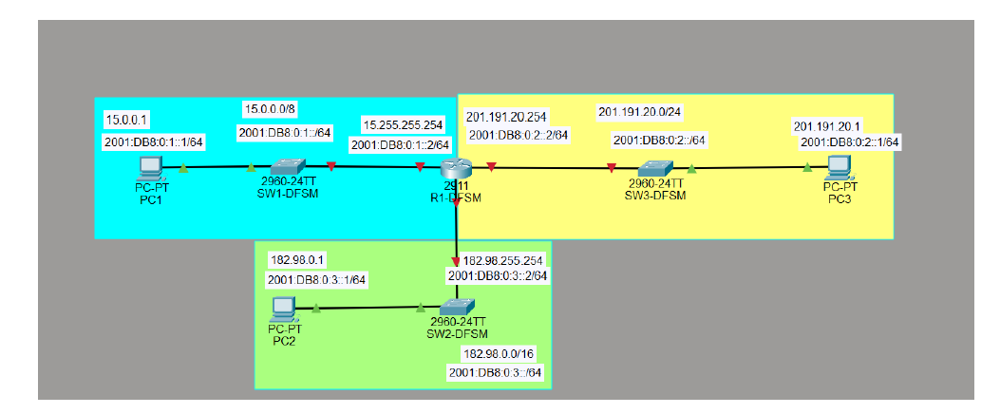

# 🛰️ Ingénierie Réseaux Cisco : Adressage VLSM & Transition IPv6
> Expertise Réseaux & Télécoms | ECE Paris

---
### 📄 [Télécharger le Rapport Technique Complet (PDF)](../TP4-IPv6-Franck-DEFFO.pdf)
---

## 📝 Objectif du Projet
Concevoir une infrastructure multi-sites résiliente, optimisée par un adressage VLSM (IPv4) et préparée aux standards de demain via une configuration Dual-Stack IPv6 complète.

## 🏗️ Architecture du Réseau

*Conception d'une infrastructure interconnectant 3 LANs distincts via un routeur Cisco 2911, avec segmentation par zones.*

## 🛠️ Réalisations Techniques

### 1. Ingénierie de l'Adressage (VLSM & Dual-Stack)
*   **Optimisation IPv4** : Calcul de sous-réseaux à masques variables pour répondre aux besoins spécifiques de chaque LAN (de 9 à 64 hôtes).
*   **Déploiement IPv6** : Mise en œuvre d'un adressage **Global Unicast** et configuration du mécanisme **SLAAC** pour l'autoconfiguration des postes clients.

### 2. Routage & Diagnostic
*   **Routage Unicast** : Activation du transfert de paquets IPv6 et configuration des passerelles par défaut.
*   **Vérification technique** : Analyse des tables de routage pour garantir l'étanchéité et la fluidité des flux.

## ✅ Validation du Projet
La réussite de l'infrastructure est confirmée par des tests de connectivité de bout en bout entre tous les segments du réseau.

*Succès des tests de Ping en IPv6 validant la communication entre le PC1 et les réseaux distants.*

---
[⬅️ Retour à l'accueil](../README.md)
